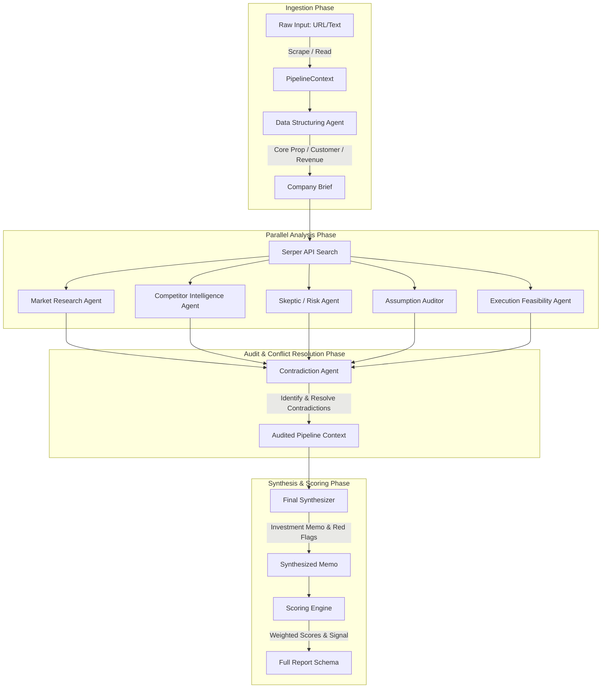
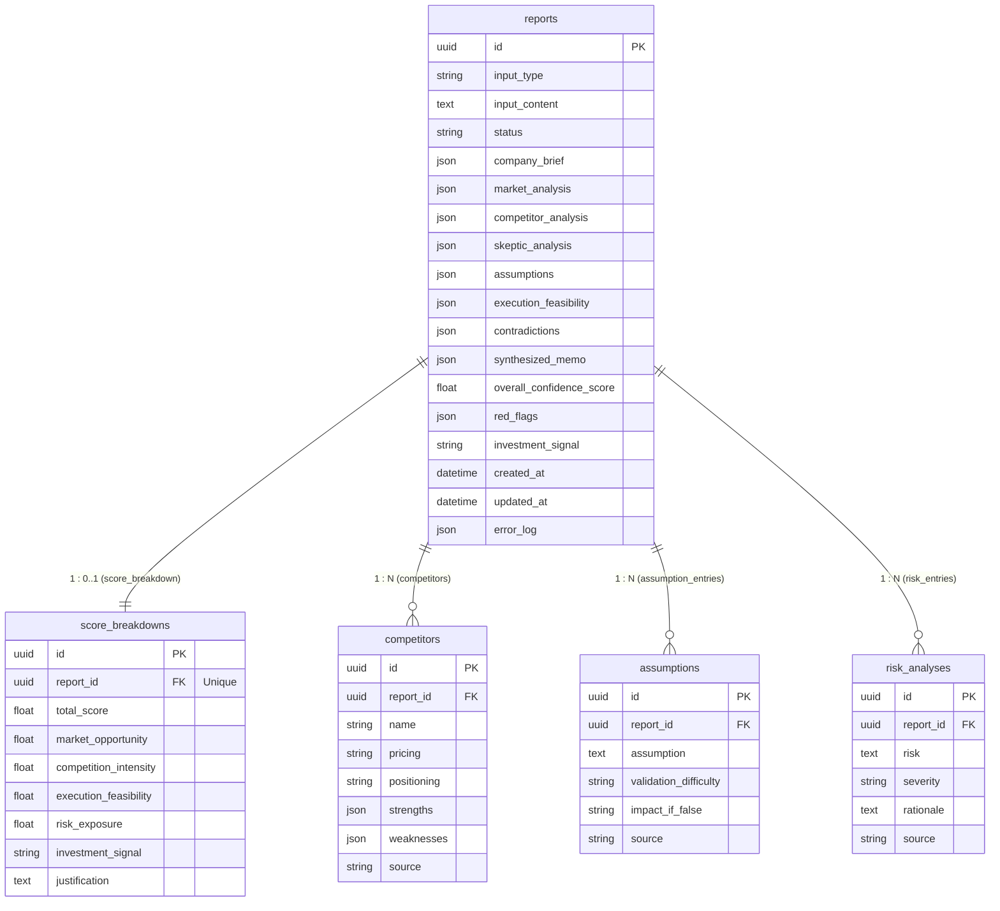

# Architectural Design Specification

This document details the architectural layout, data flow, multi-agent orchestrator, database design, and frontend architecture of **Apex Intel**.

---

## 1. Multi-Agent System & Core Workflow

Apex Intel implements a collaborative **multi-agent pipeline** using a **Supervisor-Orchestrator** model. Instead of relying on conversational chat agents, the system runs as a structured data-processing pipeline where each agent consumes data, calls LLM APIs, validates the output against a Pydantic boundary schema, and appends it to a shared `PipelineContext`.

---

## 2. The 5-Phase Orchestrator Flow

The `MainOrchestrator` (`backend/core/orchestrator/main_orchestrator.py`) runs the pipeline in the background using FastAPI `BackgroundTasks`. It coordinates the transition between phases, updates progress metrics, and records transaction logs.

| Phase | Name | Agents/Services Involved | Description | Progress Indicator |
|---|---|---|---|---|
| **Phase 1** | **Data Structuring** | `ScrapingService`, `DataAgent` | Scrapes target URL or processes raw text, filters marketing hype, extracts core value prop, target segments, and product type into a structured JSON briefing. | `20%` |
| **Phase 2** | **Parallel Analysis** | `SearchService` & 5 specialized Agents | Executes 5 agents in parallel via `asyncio.gather`. Searches the web for sizing, trends, competitors, and risk factors, validating schemas for each domain. | `60%` |
| **Phase 3** | **Contradiction Detection** | `ContradictionAgent` | Scans all Phase 2 outputs to check for data mismatch or logical conflicts, attempting to resolve them or flags them for human review. | `75%` |
| **Phase 4** | **Synthesis** | `Synthesizer` | Compiles the validated, contradiction-resolved outputs into a single cohesive Investment Memo containing a summary brief and red flags. | `90%` |
| **Phase 5** | **Scoring** | `ScoringEngine` | Applies weighted calculations on the memo content to output sub-scores, a total score (0-100), and a final investment signal (**STRONG**, **MODERATE**, **WEAK**). | `100%` |

---

## 3. Database Schema Design

The persistence layer is managed using **SQLAlchemy 2.0 Async** mapping to a PostgreSQL database. 

- **JSON Columns on `reports`:** To preserve raw execution context, each agent's individual output is stored directly on the `reports` table in a JSON column.
- **Relational Tables:** Fields requiring structured querying, lists, or comparisons (e.g. competitor comparison, risk tables) are extracted and written to dedicated tables (`competitors`, `assumptions`, `risk_analyses`, `score_breakdowns`) with cascading foreign keys.

---

## 4. Frontend Architecture

The React UI is designed to feel like a high-end financial analytical dashboard (Stripe and Bloomberg Terminal aesthetic), using a border-first responsive structure and minimal decoration.

### Data Fetching & State Management
- **TanStack Query (React Query):** Managed inside `frontend/src/app/providers.tsx`. Handles API polling strategies for live statuses (`GET /analyze/{id}/status`), page fetches, and library listings.
- **Mock Data Generator:** Built as a V2-ready fallback layer in `frontend/src/lib/mock-data.ts`. The pages interact with this mock model, allowing immediate UI demonstration without database dependencies.

### Component Design Philosophy
- **Border-First Design:** Instead of drop-shadows or gradients, the UI relies on thin border borders (`border-zinc-800`) and structured spacing rules to divide screen real-estate.
- **Color Aesthetics:** The UI features dark mode styling. Standard interactive hover states use subtle color changes (`bg-zinc-900`, `hover:border-zinc-700`). Color is applied only for semantic signals (Green for `STRONG` signals, Yellow for `MODERATE`, Red for `WEAK` and critical Red Flags).
- **JetBrains Mono for Metrics:** Numeric outputs, tabular metric displays, and logs are rendered using `JetBrains Mono` for maximum alignment and readability.
