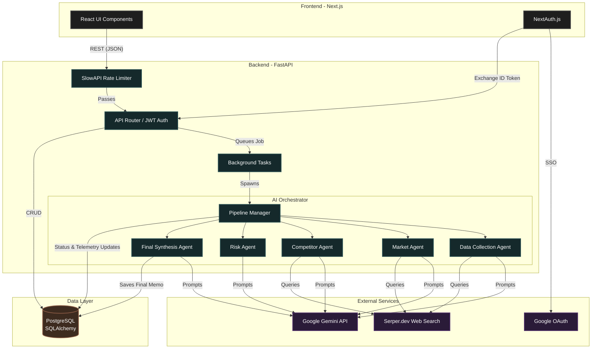

# Apex Intel Architecture

The following diagram illustrates the high-level architecture of the Apex Intel platform, designed for new contributors to understand the system flow at a glance.

## Core Components
- **Frontend**: Next.js 16 with React Server Components, styled via Tailwind CSS. NextAuth handles initial Google SSO, but the backend is the source of truth for user models.
- **Backend**: FastAPI with async Python. Routes are protected via JWTs generated during the NextAuth token exchange.
- **AI Orchestrator**: A multi-agent DAG (Directed Acyclic Graph) pipeline. Agents act independently, querying web sources (Serper) and reasoning (Gemini) before a Final Synthesis agent compiles the investment memo.
- **Database**: PostgreSQL driven by SQLAlchemy (asyncpg). Tracks Users, Subscriptions, Credits, Reports, and Orchestration Telemetry.
